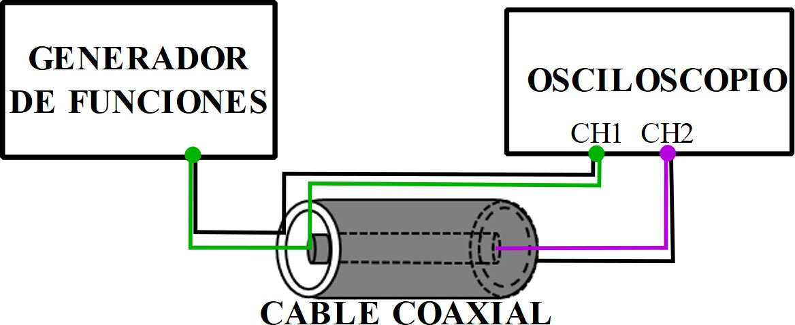
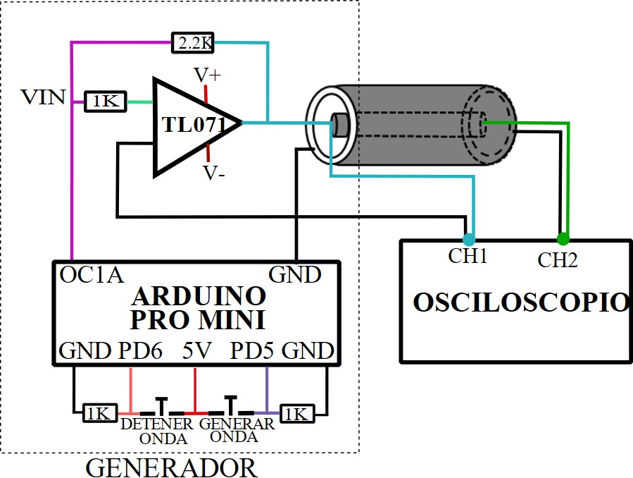
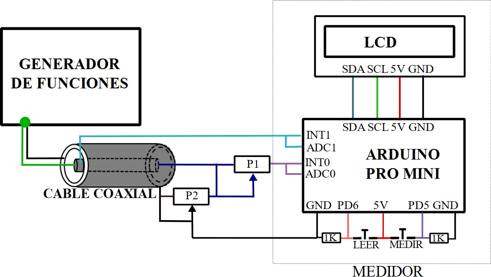
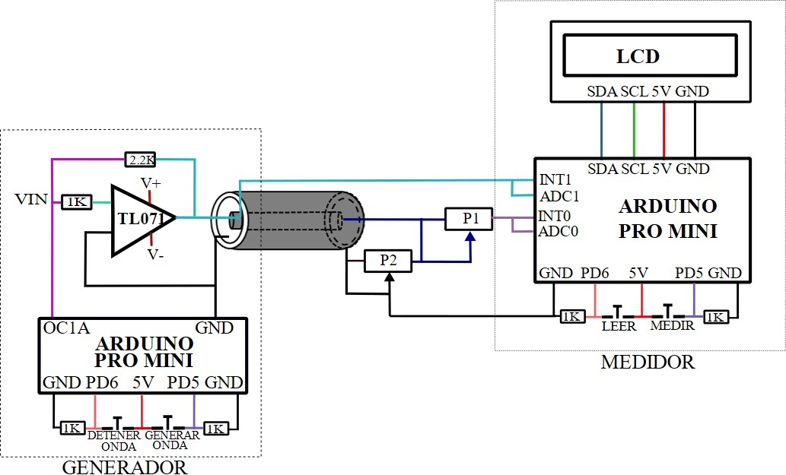
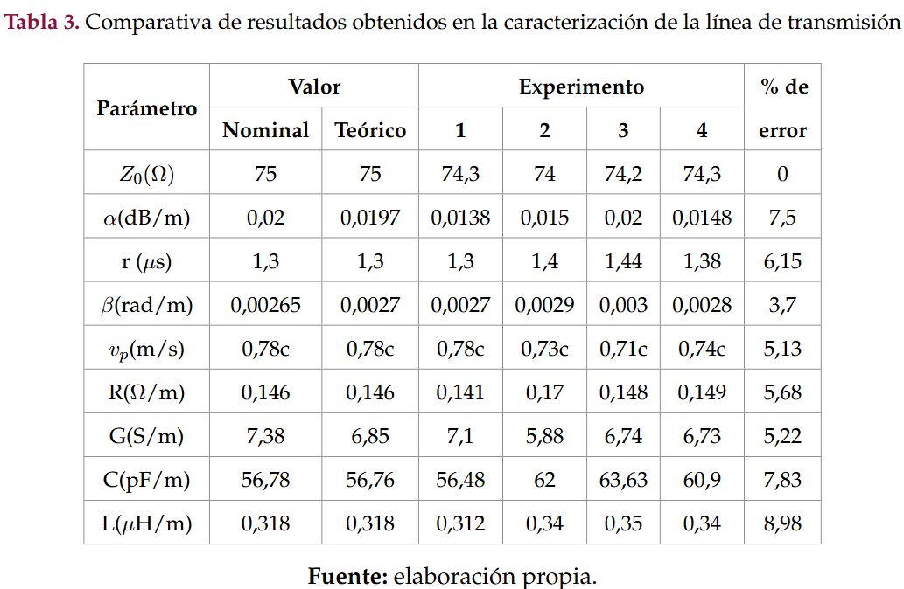

# Measuring parameters in transmission lines with embedded systems

**Repository for results and code related to the paper: "Measuring parameters in transmission lines with embedded systems"**  
*Published in Tecnura Journal*  
[Link to Full Paper](https://revistas.udistrital.edu.co/index.php/Tecnura/article/view/18131/18360)

---

## Table of Contents
1. [Introduction](#introduction)
2. [Usage](#usage)
3. [Results](#results)

---

## Introduction
This repository provides the code to replicate our results. Our goal was to explain the operation of a transmission line parameter measurement system as a low-cost and automated proposal for its characterization, implemented through embedded systems (Arduino in this case). 

## Usage
The following shows the schematic circuits needed to replicate our experiments (4 in total). For further details, please refer to the paper.

## Results

